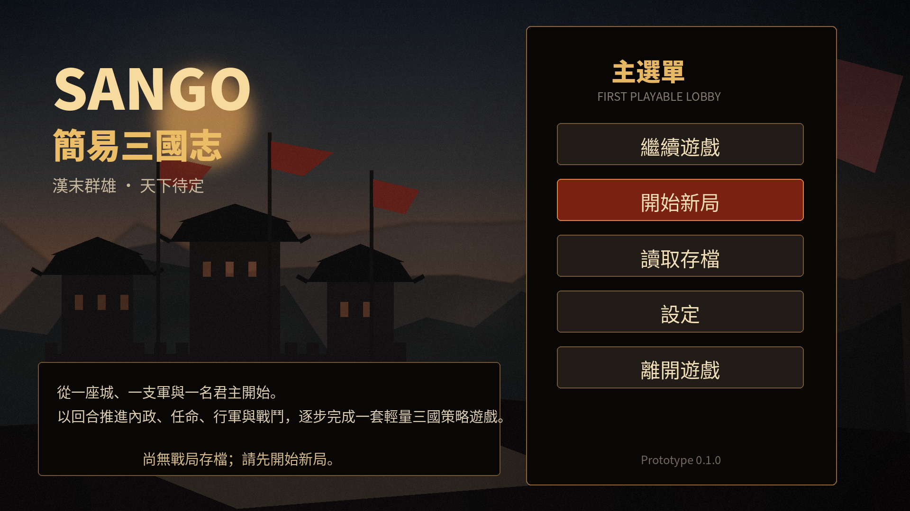

# Sango

Java 17 + LibGDX 的輕量三國策略遊戲原型。本次交付以 StudyRoutine 的 SimpleUI 初始化、XML UI、Screen registry 與資產配置方式為基礎，建立第一個可操作 Lobby。

## Lobby 版面預覽

> 這是依 XML 與 Style 配置製作的版面預覽，不是容器內的 LWJGL3 實機截圖。



## 已完成

- 三國風 Lobby／主選單與原創 1920 × 1080 背景。
- SimpleUI 1.1.2：XML 定義版面，Java 管理事件與狀態。
- `ScreenId` + SimpleUI Screen registry。
- 「開始新局」確認遮罩與最小戰局流程驗證畫面。
- 「繼續遊戲」依測試進度自動啟用。
- 「讀取存檔」保留為 disabled，避免偽造尚未定義的 SaveGame。
- 設定遮罩：背景音樂與介面音效偏好保存。
- 離開確認、Desktop `ESC` 與 Android Back 行為。
- Desktop `1280 × 720`；內部 `FitViewport(1920, 1080)`。
- Android 橫向 Manifest、Theme 與沉浸模式。
- SimpleUI JAR 會先排除內含的 `com/badlogic/**`，避免與專案 LibGDX dependency 發生 duplicate class 或版本衝突。
- 動態字型 atlas page 使用 `256 × 256`，可容納 Lobby 的 `118 px` Source Han Sans Heavy glyph。

## 第一次執行前：準備中文字型

此 ZIP 不重複攜帶 StudyRoutine 已有的兩個大型字型二進位檔。請在 Windows PowerShell 執行：

```powershell
.\tools\prepare-local-fonts.ps1 -StudyRoutineSource "C:\path\to\StudyRoutineCurated-source.zip"
```

參數也可以指向解壓後的 StudyRoutine 專案目錄。若 `StudyRoutineCurated-source.zip` 位於 Sango 專案上一層，可直接執行：

```powershell
.\tools\prepare-local-fonts.ps1
```

腳本會準備：

```text
assets/font/SourceHanSansCN-Regular.otf
assets/font/SourceHanSansCN-Heavy.otf
```

可先驗證字型是否齊全：

```powershell
.\gradlew.bat verifyRequiredLocalFonts
```

## 執行 Desktop

```powershell
.\gradlew.bat lwjgl3:run
```

macOS／Linux：

```bash
./gradlew lwjgl3:run
```

## 建置驗證

```powershell
.\gradlew.bat clean core:compileJava lwjgl3:dist
```

Android Debug APK：

```powershell
.\gradlew.bat android:assembleDebug
```

## 主要結構

```text
assets/ui/lobby.xml
assets/ui/prototype_campaign.xml
assets/i18n/ui_zh_Hant.xml
core/src/main/java/idv/kuan/studio/sango/
├─ Main.java
├─ data/SangoPreferences.java
├─ provider/SangoAppContextConfigProvider.java
└─ ui/
   ├─ LobbyScreen.java
   ├─ PrototypeCampaignScreen.java
   ├─ id/ScreenId.java
   └─ theme/SangoUiStyles.java
```

`SangoPreferences` 目前只保存 Lobby 原型旗標與介面偏好。正式戰局資料不應放入 Preferences；下一階段建議建立：

```text
ScenarioDefinition
→ FactionDefinition
→ NewGameCommand
→ SaveGameRepository
```

## GdxTools

本階段沒有加入 GdxTools。Lobby 不需要 CRUD／Repository 功能，而且提供的 StudyRoutine snapshot 只留下 `../../api/GdxTools/core` 外部路徑，未包含該 module。等 SaveGame 資料模型確定後，再以明確版本或可攜式 module 接入，可避免交付 ZIP 綁死本機目錄。

## 驗證狀態

已完成：

- Java 17 離線 `javac` 核心原始碼編譯檢查。
- SimpleUI 內建 XSD validator：兩份 UI XML 均通過。
- i18n key、中文 characters 與必要資產靜態檢查。

本執行環境無法下載 Gradle distribution，因此未在容器內完成 LWJGL3 實際啟動畫面；回到可連線且有 Gradle cache 的開發機後，請執行上述建置命令完成最終 runtime 驗證。

## 第三方與授權

詳見 `THIRD_PARTY_NOTICES.md`。SimpleUI snapshot 未附授權檔；對外散布前應確認授權。
